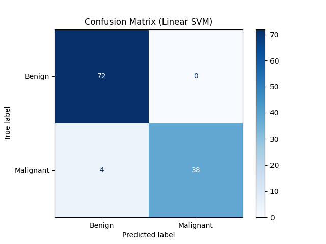
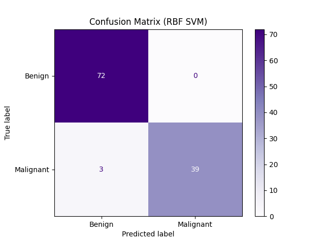
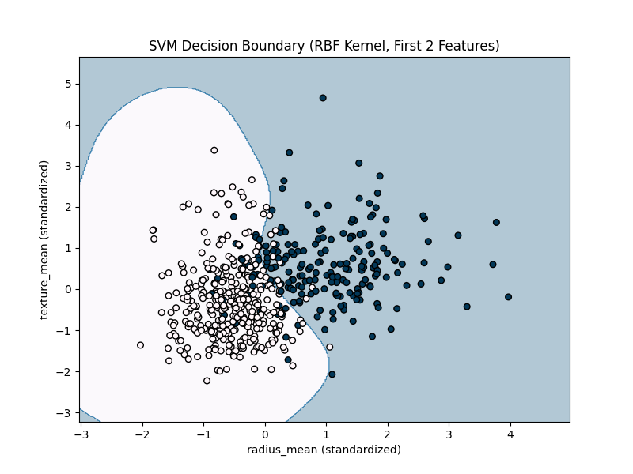
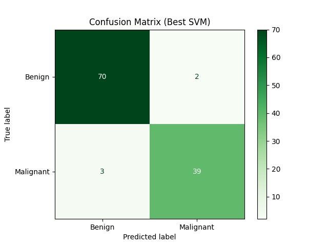

# Breast Cancer Classification with Support Vector Machines

This project demonstrates how to use Support Vector Machines (SVM) with both linear and RBF kernels to classify breast cancer as benign or malignant. The workflow includes model evaluation, decision boundary visualization, hyperparameter tuning, and cross-validation.

---

## Dataset

- **File:** `breast-cancer.csv`
- **Rows:** 569
- **Features:** 30 numeric clinical features
- **Target:** `diagnosis` (1 = malignant, 0 = benign)

---

## Workflow

### 1. Data Loading and Inspection
```
import pandas as pd
df = pd.read_csv('breast-cancer.csv')
print(df.info())
print(df.head())
print(df['diagnosis'].value_counts())
*Checked for missing values and class balance.*
```

---

### 2. Data Preprocessing

- Dropped the `id` column.
- Converted `diagnosis` to numeric (`M`=1, `B`=0).
- Standardized all features using `StandardScaler`.
```
from sklearn.preprocessing import StandardScaler

df = df.drop('id', axis=1)
df['diagnosis'] = df['diagnosis'].map({'M': 1, 'B': 0})
X = df.drop('diagnosis', axis=1)
y = df['diagnosis']
scaler = StandardScaler()
X_scaled = scaler.fit_transform(X)
```

---

### 3. Train-Test Split
```
from sklearn.model_selection import train_test_split
X_train, X_test, y_train, y_test = train_test_split(
X_scaled, y, test_size=0.2, random_state=42, stratify=y)
```
*Ensured unbiased model evaluation.*

---

### 4. Linear SVM
```
from sklearn.svm import SVC
svm_linear = SVC(kernel='linear', random_state=42)
svm_linear.fit(X_train, y_train)
```
*Trained a linear SVM classifier.*

---

### 5. Evaluation: Linear SVM
```
from sklearn.metrics import confusion_matrix, ConfusionMatrixDisplay, classification_report

y_pred_linear = svm_linear.predict(X_test)
cm_linear = confusion_matrix(y_test, y_pred_linear)
disp = ConfusionMatrixDisplay(confusion_matrix=cm_linear, display_labels=['Benign', 'Malignant'])
disp.plot(cmap='Blues')
plt.title('Confusion Matrix (Linear SVM)')
plt.show()

print("Classification Report (Linear SVM):\n", classification_report(y_test, y_pred_linear, target_names=['Benign', 'Malignant']))
```


---

### 6. RBF SVM
```
svm_rbf = SVC(kernel='rbf', random_state=42)
svm_rbf.fit(X_train, y_train)
```
*Trained an SVM with RBF kernel for non-linear separation.*

---

### 7. Evaluation: RBF SVM
```
y_pred_rbf = svm_rbf.predict(X_test)
cm_rbf = confusion_matrix(y_test, y_pred_rbf)
disp = ConfusionMatrixDisplay(confusion_matrix=cm_rbf, display_labels=['Benign', 'Malignant'])
disp.plot(cmap='Purples')
plt.title('Confusion Matrix (RBF SVM)')
plt.show()

print("Classification Report (RBF SVM):\n", classification_report(y_test, y_pred_rbf, target_names=['Benign', 'Malignant']))
```


---

### 8. Decision Boundary Visualization (RBF SVM, 2 features)

Used first two features for 2D visualization.
```
import numpy as np
X_vis = X_scaled[:, :2]
X_train_vis, X_test_vis, y_train_vis, y_test_vis = train_test_split(
X_vis, y, test_size=0.2, random_state=42, stratify=y)
svm_rbf_vis = SVC(kernel='rbf', random_state=42)
svm_rbf_vis.fit(X_train_vis, y_train_vis)

x_min, x_max = X_vis[:, 0].min() - 1, X_vis[:, 0].max() + 1
y_min, y_max = X_vis[:, 1].min() - 1, X_vis[:, 1].max() + 1
xx, yy = np.meshgrid(np.arange(x_min, x_max, 0.02),
np.arange(y_min, y_max, 0.02))
Z = svm_rbf_vis.predict(np.c_[xx.ravel(), yy.ravel()])
Z = Z.reshape(xx.shape)

plt.figure(figsize=(8, 6))
plt.contourf(xx, yy, Z, alpha=0.3, cmap=plt.cm.PuBu)
plt.scatter(X_vis[:, 0], X_vis[:, 1], c=y, edgecolor='k', cmap=plt.cm.PuBu, s=30)
plt.xlabel('radius_mean (standardized)')
plt.ylabel('texture_mean (standardized)')
plt.title('SVM Decision Boundary (RBF Kernel, First 2 Features)')
plt.show()
```


---

### 9. Hyperparameter Tuning (C and gamma) with Cross-Validation
```
from sklearn.model_selection import GridSearchCV

param_grid = {
'C': [0.1, 1, 10, 100],
'gamma': [0.001, 0.01, 0.1, 1]
}
grid_search = GridSearchCV(
SVC(kernel='rbf', random_state=42),
param_grid,
cv=5,
scoring='accuracy',
n_jobs=-1
)
grid_search.fit(X_train, y_train)
print("Best parameters found:", grid_search.best_params_)
print("Best cross-validation accuracy:", grid_search.best_score_)
```
*Systematically tuned C and gamma for best performance.*

---

### 10. Final Evaluation (Best SVM)
```
best_svm = grid_search.best_estimator_
y_pred_best = best_svm.predict(X_test)
cm_best = confusion_matrix(y_test, y_pred_best)
disp = ConfusionMatrixDisplay(confusion_matrix=cm_best, display_labels=['Benign', 'Malignant'])
disp.plot(cmap='Greens')
plt.title('Confusion Matrix (Best SVM)')
plt.show()

print("Classification Report (Best SVM):\n", classification_report(y_test, y_pred_best, target_names=['Benign', 'Malignant']))
```

---

## Key Insights

- **RBF SVM with hyperparameter tuning achieved 96% accuracy** on the test set.
- **Decision boundary visualization** shows the power of non-linear kernels for separating complex classes.
- **Cross-validation and grid search** ensure robust, generalizable model performance.

---

**Author:** Saksham Bindal

